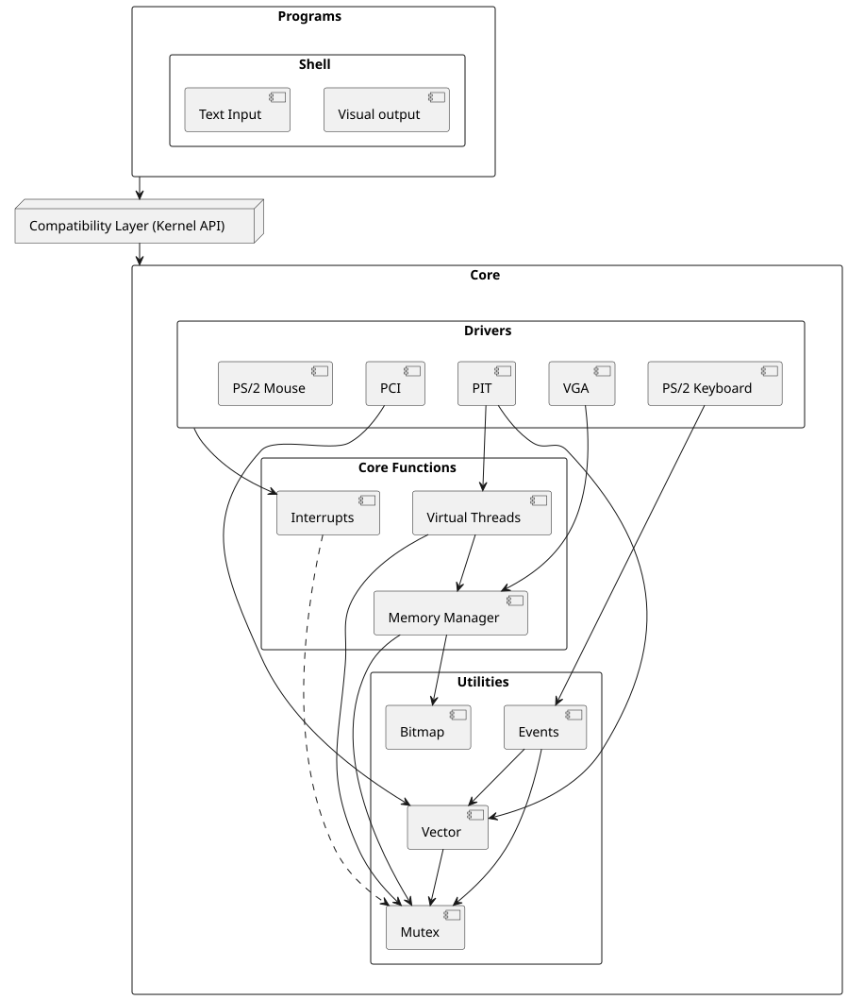

# VirtualReflectionsOS (Altered State-0)
A 64-bit custom made operating system, using grub as bootloader

## Setup build environment
### Windows host
```powershell
PS> docker build . -t virtual_reflections_os_buildenv
```

### Usage
When inside the build env. run the `build.sh` script to automatically `make clean && make build`.
```bash
$ ./build.sh
```

## Building the ISO
### Windows host
```powershell
PS> .\docker_build.ps1
```

### Used commands
`docker run --name VirtualReflectionsOS --rm -v "${PWD}:/root/env" virtual_reflections_os_buildenv`

## Running QEMU
Start the QEMU environment with the required startup flags.

### Windows host
```powershell
PS> .\qemu_start.ps1
```
### Used commands
`qemu-system-x86_64.exe -cdrom build/VirtualReflectionsOS.iso -m 2G -drive format=raw,file=build/disk.vhd,id=disk,if=none -device ahci,id=ahci -device ide-hd,drive=disk,bus=ahci.0`

#### Extra arguments
These are being used for testing and not yet required to launching the OS
`-net nic,model=pcnet`

## Diagram


## Resources
### YouTube
[Write Your Own 64-bit Operating System Kernel - https://www.youtube.com/watch?v=wz9CZBeXR6U](https://www.youtube.com/watch?v=wz9CZBeXR6U) <br>

### GitHub
[MonkOS - https://github.com/beevik/MonkOS](https://github.com/beevik/MonkOS) <br>
[os64 - https://github.com/luke8086/os64](https://github.com/luke8086/os64) <br>
[wyoos - https://github.com/AlgorithMan-de/wyoos](https://github.com/AlgorithMan-de/wyoos) <br>
[osakaOS - https://github.com/pac-ac/osakaOS](https://github.com/pac-ac/osakaOS) <br>
[uefi-os - https://github.com/sansoune/uefi-os](https://github.com/sansoune/uefi-os)<br>
[MmdOS - https://github.com/Rostamborn/MmdOS](https://github.com/Rostamborn/MmdOS/blob/master/src/kernel/scheduler/process.c)<br>